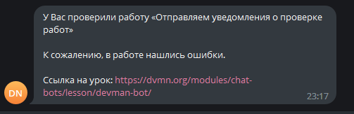

# Devman Notifications Bot

---

Бот для отправки уведомлений о проверке работ на сайте Devman. Поддерживает логирование в Телеграм.

## Подготовка к запуску
Первым делом, скачайте код:
``` 
git clone https://github.com/pas-zhukov/devman-bot.git
```

### Создание бота

Создайте бота в телеграмме, который будет отправлять Вам сообщения. Для этого нужно напишите [отцу ботов](https://github.com/pas-zhukov/watching-storage).
Инструкция по созданию бота и получению токена: [ссылка](https://botcreators.ru/blog/botfather-instrukciya/).

Второй токен можно найти в Вашем личном кабинете на сайте [Devman.org](https://dvmn.org/api/docs/). Он необходим для отслеживания проверок пройденных Вами уроков.

## Переменные окружения

В корне с программой подготовьте файл `.env` и заполните его следующим содержимым:
``` 
BOT_TOKEN=<Токен вашего бота>
DVMN_TOKEN=<Ваш токен с сайта devman>
USER_ID=<Ваш ID Телеграм, на него бот будет присылать уведомления> # Чтобы его узнать, напишите [этому боту](https://t.me/userinfobot).
ADMIN_CHAT_ID=<ID чата, куда будут отправляться логи бота>
```

## Запуск с Docker (рекомендуется)

Для запуска понадобится [Docker Desktop](https://docs.docker.com/desktop/install/windows-install/) (удобен, если Вы запускаете проект на локальной машине), либо [Docker Engine](https://docs.docker.com/engine/install/ubuntu/#install-using-the-repository) (для запуска на сервере).

1. Чтобы бот мог писать Вам сообщения, напишите ему любое сообщение от своего имени.

2. Соберите докер-образ:
```shell
docker build -t devman-bot .
```
3. Запустите докер-контейнер:
```shell
docker run -pd devman-bot --env-file <путь к Вашему `.env` файлу>
```

4. Если всё было сделано правильно, после проверки задания преподавателем, Вы получите сообщение следующего вида:



## Запуск без контейнеризации

Установите зависимости, перечисленные в `reqirements.txt`.
```
pip install -r requirements.txt
```
Проверить, что все необходимые библиотеки на месте:
``` 
pip list
```

### Запуск

1. Чтобы бот мог писать Вам сообщения, напишите ему любое сообщение от своего имени.

2. Для запуска бота необходимо прописать следующую команду:
```
python main.py
```

## Цели проекта

Код написан в учебных целях — это урок на курсе по Python и веб-разработке на сайте Devman.